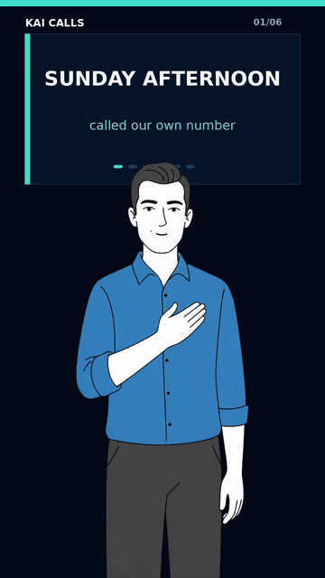

# cartoonimator

[](https://github.com/cgallic/cartoonimator/actions/workflows/ci.yml)
[](https://www.python.org/downloads/)
[](https://opensource.org/licenses/MIT)

**AI illustrates, code animates.**

<p>
  <a href="https://github.com/cgallic/cartoonimator/blob/main/demo.mp4">
    
  </a>
  <br>
  <em>▶ <a href="https://github.com/cgallic/cartoonimator/blob/main/demo.mp4">Watch in HD (MP4, 4.3 MB)</a> — a real <a href="https://kaicalls.com">KaiCalls</a> commercial rendered with cartoonimator</em>
</p>

Deterministic mascot animation: feed it a pose PNG, an audio WAV, and a few anchor coordinates. Get back a lip-synced cartoon video. No diffusion in the render loop, no frame-to-frame wobble, no GPU required.

```python
from cartoonimator import load_mascot, render_scene

render_scene(
    mascot=load_mascot("mascots/kai"),
    audio_wav="hello.wav",
    background_png="assets/backgrounds/solid_deep_navy_1080x1920.png",
    output="hello.mp4",
)
```

## The idea

Diffusion models are great at illustrating consistent character art. They are bad at frame-to-frame consistency — every frame redraws the body, eyebrows, hands, costume seams. Faces wobble. Hands grow extra fingers between frames.

So split the job:

- **AI is the illustrator.** Generate one canonical body per pose, once. Lock it. (Use Stable Diffusion, GPT Image, Midjourney — whatever produces the model sheet you want.)
- **Code is the animator.** PIL draws mouth states on top at known anchor coordinates. Rhubarb maps audio → visemes. FFmpeg muxes the result. The body never changes pixels between talking frames.

That's it. The body never wobbles because the body is a static image. The mouth follows the audio because Rhubarb says it should. The eyes blink because we draw a horizontal line over them every few seconds.

## Quickstart

Install system dependencies:

```bash
# ffmpeg
sudo apt-get install ffmpeg                         # Debian/Ubuntu
brew install ffmpeg                                  # macOS

# Rhubarb Lip Sync (https://github.com/DanielSWolf/rhubarb-lip-sync/releases)
# Download the binary for your OS, put it on $PATH (or set RHUBARB_BINARY)
```

Install the package:

```bash
pip install cartoonimator
```

Verify the install:

```bash
cartoonimator demo out.mp4
```

Render with your own audio:

```bash
cartoonimator render \
    --mascot mascots/kai \
    --audio examples/hello.wav \
    --output hello.mp4
```

Or in Python:

```python
from cartoonimator import load_mascot, render_scene

render_scene(
    mascot=load_mascot("mascots/kai"),
    audio_wav="hello.wav",
    background_png="assets/backgrounds/solid_deep_navy_1080x1920.png",
    output="hello.mp4",
    pose_cut_interval_s=2.0,
)
```

## Bring your own mascot

A mascot is a directory with three files plus a poses folder:

```
my_mascot/
├── anchors.json            # mouth + eye coordinates per pose
├── poses-manifest.json     # pose IDs and filenames
├── character-bible.md      # personality notes (optional)
└── poses/
    ├── standing_open_hands.png
    ├── pointing_at_camera.png
    └── ...
```

The included `mascots/kai/` is the reference. To make your own:

1. Generate pose PNGs at 1024×1024 with transparent backgrounds. (Tip: green-screen the AI output, then run `bg_remover.remove_green` to get clean alpha.)
2. Run `cartoonimator tag --mascot my_mascot --port 8801` and click mouth/eye anchors in the browser at `http://localhost:8801`.
3. Render.

See `docs/anchors.md` for the anchor schema and tagger workflow, and `docs/architecture.md` for how the renderer assembles a scene.

## TTS — bring your own audio (or plug in a provider)

The core API takes a WAV path. Generate audio however you want — record yourself, use a local TTS like Piper, hit ElevenLabs, etc.

For convenience, optional providers are bundled:

```python
from cartoonimator.tts import ElevenLabsProvider

provider = ElevenLabsProvider(api_key="...", voice_id="...")
audio_path = provider.synthesize("Hello there.", out_path="hello.mp3")
render_scene(audio_wav=audio_path, ...)
```

A MOSS-TTS provider stub is included for users running a self-hosted MOSS-TTS server.

## Other commands

```bash
# Trim a clip
cartoonimator cut --input long.mp4 --start 12.0 --end 27.5 --output clip.mp4

# Mix music under an existing video
cartoonimator mix-music --video clip.mp4 --music score.mp3 --volume 0.15 --output final.mp4

# Generate a fresh mascot pose library from prompts (needs OPENROUTER_API_KEY)
# Requires mascots/yourname/character-bible.md (with a fenced base prompt)
# and mascots/yourname/pose-specs.json (list of {id, prompt, description}).
cartoonimator build-library --char-dir mascots/yourname --workers 5
```

The library generator uses GPT Image 2 via OpenRouter to render each pose against a green-screen background, then keys the green out to produce transparent PNGs ready for `cartoonimator tag`. See `mascots/kai/pose-specs.json` for a reference spec format.

## How it compares

|                              | cartoonimator | Adobe Character Animator | Live2D | Synthesia / HeyGen |
|------------------------------|:-------------:|:------------------------:|:------:|:------------------:|
| Open source                  | ✅            | ❌                       | ❌     | ❌                 |
| Self-hosted, no API costs    | ✅            | ❌ (Adobe sub)           | ✅     | ❌ (per-minute)   |
| Code-driven (CI, scriptable) | ✅            | ❌ (GUI)                 | ❌ (GUI) | ⚠️ (API only)    |
| Deterministic output         | ✅            | ⚠️ (live capture varies) | ✅    | ❌                 |
| GPU required                 | ❌            | ❌                       | ❌     | ✅ (cloud)        |
| Photorealistic              | ❌ (cartoon)  | ❌                       | ❌     | ✅                 |
| Bring your own art           | ✅            | ⚠️ (Adobe puppets)       | ✅    | ❌ (avatar library) |

In one line: **a CLI version of Adobe Character Animator's lip-sync, brand-agnostic, MIT-licensed, with no facial-tracking webcam loop.**

## What this is not

- Not a video editor. Cuts are pose changes every N seconds. No transitions, no effects, no zooms.
- Not photorealistic. Cartoon mascots only. The whole point is that the body doesn't move between frames.
- Not real-time. It's batch — render once, deliver an MP4.

## License

MIT. See `LICENSE`.

## Made by

Built by [Connor Gallic](https://connorgallic.com) alongside [KaiCalls](https://kaicalls.com) (AI voice agent) and [MeetKai](https://meetkai.xyz) (AI marketing execution). Kai — the reference mascot — is the shared brand character across both.


---

*Built and maintained by [Connor Gallic](https://pr.linkedin.com/in/cgallic) — connect on LinkedIn.*
